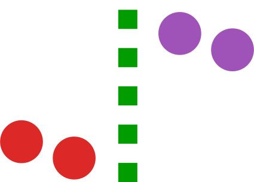

<div align="center">
    
</div>

<h2 align="center">RegressionDiscontinuity.jl</h2>
<p align="center"> A Julia package for Regression Discontinuity analyses.</p>
<p align="center">
  <a href="https://github.com/nignatiadis/RegressionDiscontinuity.jl/workflows/CI/badge.svg">
    
  </a>
  <a href="https://codecov.io/gh/nignatiadis/RegressionDiscontinuity.jl/">
    
  </a>
</p>


## Examples

We demonstrate the basic functionality of the package using the U.S. House Elections dataset of [Lee (2008)](https://www.sciencedirect.com/science/article/abs/pii/S0304407607001121).

```julia
julia> using RegressionDiscontinuity
julia> data = load_rdd_data(:lee08)
```

### Naive Local Linear Regression
The following estimates the sharp RDD estimate using local linear regression
without any kind of bias correction. It uses a rectangular kernel and the
Imbens-Kalyanaraman bandwidth.

```julia
julia> fit(NaiveLocalLinearRD(kernel = Rectangular(), bandwidth = ImbensKalyanaraman()), data.ZsR, data.Ys)
```

```
Local linear regression for regression discontinuity design
       ⋅⋅⋅⋅ Naive inference (not accounting for bias)
       ⋅⋅⋅⋅ Rectangular kernel (U[-0.5,0.5])
       ⋅⋅⋅⋅ Imbens Kalyanaraman bandwidth
       ⋅⋅⋅⋅ Eicker White Huber variance
────────────────────────────────────────────────────────────────────────────────────────────────
                          h       τ̂         se         bias     z   p-val  Lower 95%  Upper 95%
────────────────────────────────────────────────────────────────────────────────────────────────
Sharp RD estimand  0.462024  0.08077  0.0087317  unaccounted  9.25  <1e-99  0.0802225  0.0813175
────────────────────────────────────────────────────────────────────────────────────────────────
```
### Min-Max Optimal Estimator

The following estimates the sharp RDD estimate for the min-max optimal
estimator of [Imbens and Wager (2019)](https://arxiv.org/abs/1705.01677).

The estimate assumes a bound of 14.28 on the second derivative of the conditional
mean functions for the outcome in the Lee data. The optimization uses a user specified solver. The fastest option is [Mosek](https://docs.mosek.com/9.2/install/installation.html), which is free for academics. An open source alternative is [Hypatia.jl](https://github.com/chriscoey/Hypatia.jl), but it is currently slower for this problem.  

```julia
julia> using MosekTools
julia> fit(ImbensWagerOptRD(B=14.28, solver=Mosek.Optimizer), data.ZsR, data.Ys)
```

```
Imbens-Wager (2019) optimized regression discontinuity design
Max Second Derivative Bound: 14.28
────────────────────────────────────────────────────────────────────────
                          τ̂         se   max bias  Lower 95%  Upper 95%
────────────────────────────────────────────────────────────────────────
Sharp RD estimand  0.0592235  0.0197343  0.0101986  0.0159069    0.10254
────────────────────────────────────────────────────────────────────────
```

### McCrary Density Test

The following estimates a test of manipulation of the running variable based on [McCrary (2008)](https://www.sciencedirect.com/science/article/abs/pii/S0304407607001133). 

```julia
julia> fit(McCraryTest(), data.ZsR)
```

```
The McCrary (2008) test for manipulation in the
running variable for RDD.
          ⋅⋅⋅⋅ Bin size: 0.0112
          ⋅⋅⋅⋅ Bandwidth size: 0.2426
───────────────────────────────────────────────
                    θ̂         σ̂     z   p-val
───────────────────────────────────────────────
McCrary Test  0.102688  0.0798507  1.29  0.1984
───────────────────────────────────────────────
```